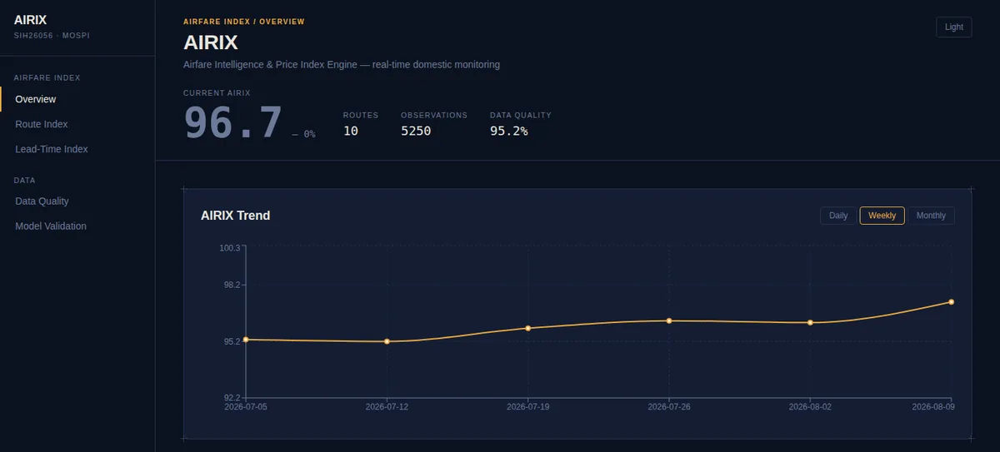

# AIRIX — Airfare Intelligence & Price Index Engine

[](https://github.com/kabir-sinha/airix/actions/workflows/tests.yml)


**SIH26056 · Ministry of Statistics & Programme Implementation (MoSPI)**

A real-time statistical price index for Indian domestic airfares. AIRIX turns individual fare observations into one defensible index, built the way an official CPI component is, and shows which routes are driving each movement and how fares change as departure approaches.



*Overview dashboard (synthetic demo data).*

## What it does

- **Collects** fares across routes, airlines and 5 booking horizons (T+45 → T+1)
- **Cleans** them with an audit trail: every flagged or excluded observation records why
- **Indexes** them with the Jevons formula, weighted by real DGCA passenger traffic
- **Explains** which routes drove each movement, with daily, weekly and monthly views
- **Validates** itself: data-quality and back-test pages, 43 automated tests

## Architecture

```
Fare data → Cleaning & audit trail → Jevons index → SQLite (dated snapshots) → FastAPI → Next.js dashboard
```

Python · FastAPI · SQLAlchemy · SQLite · Next.js · React · Tailwind CSS · Recharts · Playwright · pytest

## Design decisions and trade-offs

| Decision | Why | Trade-off |
|---|---|---|
| **Jevons index** (geometric mean of price relatives) for each route | Treats a fare doubling and a fare halving symmetrically. It is also the formula MoSPI uses for elementary indices in India's CPI 2024 series. | Less intuitive to explain than a simple average, so the dashboard shows every route's contribution alongside the headline number. |
| **Route weights from DGCA passenger traffic**, not equal weights | A thin route should not move the index as much as DEL-BOM. With DGCA city-pair data, DEL-BOM carries 21% of the weight and DEL-BLR 15%. | Weights come from the latest full year of DGCA data and stay fixed until they are refreshed. |
| **Weekly and monthly values as the geometric mean of the daily index** | Keeps one geometric-mean method at every frequency instead of mixing formulas. | A weekly or monthly value summarises the daily index levels; it is not recomputed from raw fares. |
| **Synthetic data and a mock booking site** instead of scraping live airline and OTA pages | The live fare pages we checked disallow automated access, so the scraper is proven end to end on a site built for that purpose. | The index demonstrates the method, not the live market. Production would need a licensed or government-brokered fare feed. |
| **Nothing silently dropped** | Every flagged or excluded observation keeps its reason (sold out, duplicate, outlier, missing), and the Data Quality page shows the totals. | Slightly more storage and a more detailed schema. |
| **Every pipeline run kept as a dated snapshot** (SQLite) | History is never overwritten, so the results of every past run stay available. | SQLite suits a single scheduled pipeline; a multi-user deployment would move to a server database. |
| **Validation against known ground truth** | A 35-period back-test against the index used to generate the data gives MAE 5.36 index points (MAPE 5.3%), shown openly on the Model Validation page. | This is a synthetic proxy. The back-test already accepts a real DGCA average-fare file (`--reference`), which is the next step. |

## Running locally

<details>
<summary>Setup and commands</summary>

**Backend** (Python 3.13)
```bash
cd backend
python3 -m venv venv && source venv/bin/activate
pip install -r requirements.txt
python3 generate_data.py && python3 clean_data.py && python3 calculate_dgca_weights.py
python3 calculate_index.py && python3 backtest_index.py && python3 load_to_database.py
uvicorn main:app --reload
```

**Frontend**
```bash
cd frontend
npm install && npm run dev
```

**Tests:** `cd backend && pytest`

</details>

## Repository map

```
backend/    pipeline, index maths, FastAPI app, scheduler, tests, DGCA data
frontend/   Next.js dashboard
scraper/    Playwright scraper and the mock booking site it is validated against
docs/       PS_MAPPING.md (problem statement → implementation)
```

## Team

Built by **Team AIRIX**, Bennett University, for Smart India Hackathon 2026 (SIH26056, MoSPI). Team lead: [Kabir Sinha](https://github.com/kabir-sinha).

Also by Team AIRIX: [SOCRIX](https://github.com/kabir-sinha/socrix), SOC assurance analytics for NTRO/NCIIPC (SIH26157).

## Security

Please report vulnerabilities privately — see [SECURITY.md](SECURITY.md).

## Licence and data

All rights reserved during SIH 2026 evaluation. Third-party material keeps its own terms — see [NOTICE](NOTICE):

- Route weights use DGCA traffic data from [Vonter/india-aviation-traffic](https://github.com/Vonter/india-aviation-traffic), under the [Open Database License (ODbL) 1.0](https://opendatacommons.org/licenses/odbl/1.0/). `backend/dgca_data/city_traffic.csv` and the derived `backend/route_weights.csv` stay under ODbL. Data: DGCA and Ministry of Civil Aviation.
- Fare data is synthetic or comes from the bundled mock booking site; no live airline or OTA pages were scraped.

Not affiliated with or endorsed by MoSPI, DGCA or any airline.
